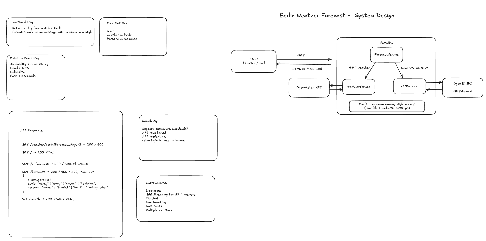
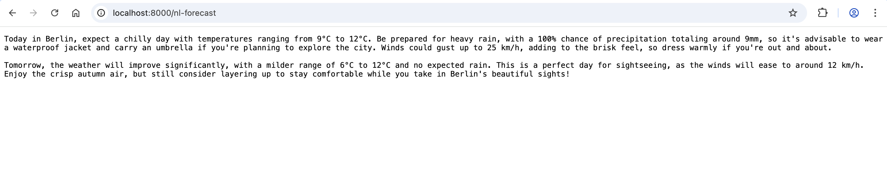
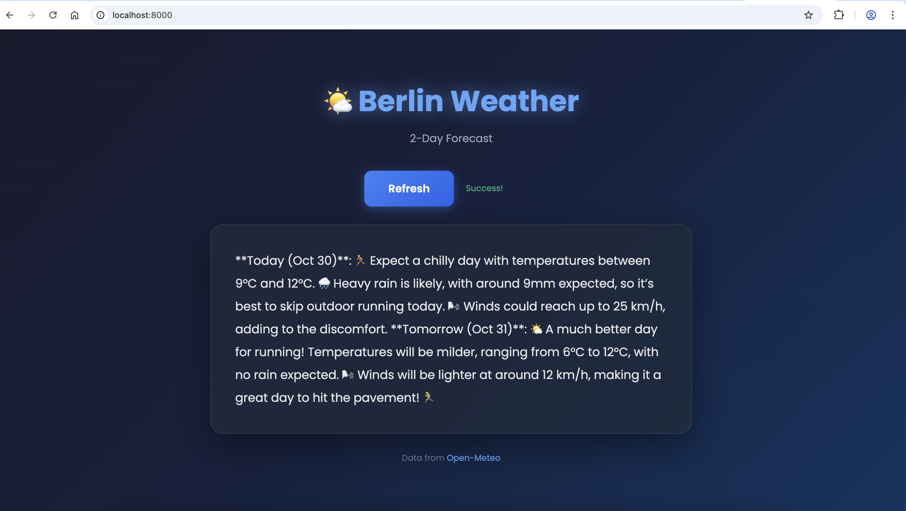

# Berlin Weather Forecast API  

A FastAPI-based service that fetches Berlin’s 2-day weather forecast from Open-Meteo and generates styled, persona-specific natural-language summaries using an LLM (GPT-4o-mini).




## How to Start

```bash
python run.py

```

GET /nl-forecast → returns the natural-language weather summary

persona = tourist, style = newsy


http://127.0.0.1:8000/ → UI for users with a Fetch button to retrieve data from the /nl-forecast endpoint

persona = runner, style = emoji
